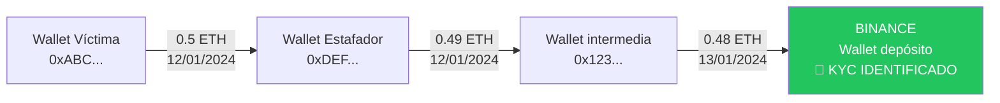

# Skill: Análisis Forense de Criptomonedas

## Objetivo principal

Rastrear el flujo de fondos desde la wallet del presunto estafador hasta un **exchange centralizado con KYC**,
generando documentación pericial válida para procedimientos judiciales en España/UE que permita:
1. Identificar al titular de la wallet ante la policía o el juzgado
2. Aportar prueba técnica al procedimiento penal
3. Solicitar requerimiento de información al exchange

---

## FASE 1 — Captura de información del caso

Antes de analizar, recopila siempre:

```
DATOS OBLIGATORIOS:
- Dirección/es de wallet del presunto estafador
- Red blockchain (Bitcoin, Ethereum, Tron/USDT-TRC20, BSC, Polygon…)
- Cantidad y fecha aproximada de la estafa
- Hash de la transacción inicial (si lo tiene la víctima)
- Wallet de la víctima (para verificar el envío)

DATOS OPCIONALES PERO ÚTILES:
- Número de diligencias previas / denuncia
- Juzgado instructor (si ya hay procedimiento abierto)
- Exchanges ya identificados por el cliente
- Comunicaciones con el estafador (capturas, emails)
```

Si faltan datos clave, pregúntalos antes de continuar.

---

## FASE 2 — Análisis on-chain

### 2.1 Herramientas por red (fuentes públicas verificables)

| Red | Explorer principal | Explorer alternativo |
|-----|-------------------|----------------------|
| Bitcoin (BTC) | blockchain.com/explorer | blockchair.com |
| Ethereum (ETH) | etherscan.io | blockchair.com |
| USDT-TRC20 / Tron | tronscan.org | — |
| USDT-ERC20 | etherscan.io (token transfers) | — |
| BSC | bscscan.com | — |
| Polygon | polygonscan.com | — |

> **Nota procesal**: Todas estas fuentes son registros públicos e inmutables. Citar siempre la URL exacta consultada y la fecha/hora de consulta (con zona horaria CET/CEST).

### 2.2 Qué analizar en cada transacción

Para cada hop del flujo de fondos, documenta:

- **Hash de transacción** (identificador único e inmutable)
- **Bloque número** y **timestamp UTC** (convertir también a hora Madrid)
- **Wallet origen → Wallet destino**
- **Cantidad** (en crypto y conversión a EUR en esa fecha — usar CoinGecko histórico)
- **Comisiones** (fees pagados)
- **Etiquetas conocidas** de la wallet destino (¿exchange? ¿mixer? ¿wallet personal?)

### 2.3 Identificación de exchanges con KYC

Señales de que una wallet pertenece a un exchange:

1. **Etiquetas en exploradores**: Etherscan y Blockchair etiquetan wallets conocidas (ej: "Binance 14", "Kraken 1", "Coinbase")
2. **Volumen masivo**: Miles de transacciones entrantes de usuarios distintos
3. **Patrones de consolidación**: Muchas wallets pequeñas enviando a una wallet central
4. **Bases de datos de etiquetas**: Consultar bitinfocharts.com y crystal blockchain (si disponible)

**Exchanges con KYC operativos en España/UE (requeribles):**
- Binance (registrado VASP en España - Banco de España)
- Coinbase (regulado MiCA/UE)
- Kraken (regulado UE)
- Bitstamp (regulado Luxemburgo)
- Bitpanda (regulado Austria)
- OKX (registrado VASP España)
- Bit2Me (exchange español - VASP Banco de España)

Lee `references/exchanges-kyc-ue.md` para información detallada de requerimiento por exchange.

### 2.4 Patrones de obfuscación a documentar

Si detectas alguno, descríbelo en el informe con lenguaje accesible:

- **Peeling chain**: Cadena de wallets intermedias que van pasando el saldo — documentar cada eslabón
- **Structuring / smurfing**: División en importes pequeños para evadir umbrales — documentar el patrón
- **Mixer / tumbler**: Servicio que mezcla fondos de distintos usuarios (ej: Tornado Cash) — señalar como indicio de ocultación dolosa
- **Swap descentralizado (DEX)**: Cambio de criptomoneda sin KYC — documentar como capa de obfuscación
- **Cadena de conversiones**: BTC → ETH → USDT para dificultar el rastreo

Lee `references/indicadores-sospechosos.md` para descripciones en lenguaje jurídico.

---

## FASE 3 — Estructura del Informe Pericial

Genera siempre el informe con esta estructura exacta:

```
INFORME PERICIAL SOBRE ANÁLISIS FORENSE DE ACTIVOS DIGITALES
=============================================================

1. DATOS DEL INFORME
2. OBJETO Y ALCANCE DEL INFORME
3. DOCUMENTOS Y FUENTES EXAMINADAS
4. METODOLOGÍA
5. HECHOS VERIFICADOS
   5.1 Transacción inicial (víctima → estafador)
   5.2 Trazabilidad de fondos
   5.3 Identificación de destino final
6. INDICIOS DE OCULTACIÓN (si los hay)
7. CONCLUSIONES PERICIALES
8. EXCHANGE IDENTIFICADO Y DATOS PARA REQUERIMIENTO
9. DECLARACIÓN DE VERACIDAD
10. ANEXOS
```

Lee `references/plantilla-informe.md` para el texto completo de cada sección.

---

## FASE 4 — Sección crítica: Exchange y Requerimiento

Esta es la sección más importante para el bufete. Genera siempre:

### Datos del exchange identificado:
- Nombre legal y nombre comercial
- País de registro y regulador competente
- Dirección legal
- Wallet/s de depósito identificadas en el análisis
- Normativa aplicable para el requerimiento

### Texto para solicitud de requerimiento judicial:
```
"Se solicita al Juzgado que libre oficio al exchange [NOMBRE],
con domicilio en [DIRECCIÓN], ordenando la aportación de:
- Datos identificativos del titular de la cuenta asociada
  a la/s dirección/es: [WALLETS]
- Registros KYC (nombre, DNI/pasaporte, dirección, teléfono, email)
- Extracto de movimientos desde [FECHA_INICIO] hasta [FECHA_FIN]
- IP de acceso y datos de dispositivo
Al amparo del artículo 588 ter a) y siguientes LECrim,
y la Directiva UE 2018/843 (AMLD5) en materia de
identificación de titulares de activos virtuales."
```

Lee `references/exchanges-kyc-ue.md` para adaptar el texto según la jurisdicción del exchange.

---

## FASE 5 — Cadena de Custodia Digital

Para cada evidencia digital, documenta:

```
EVIDENCIA Nº [X]
Tipo: Captura de explorador de bloques / Registro de transacción
Fuente: [URL exacta]
Fecha y hora de obtención: [DD/MM/YYYY HH:MM CET]
Hash SHA-256 del archivo: [hash] (si se adjunta archivo)
Método de obtención: Consulta directa a registro público inmutable
Observaciones: Los datos de la blockchain son inmutables por diseño criptográfico;
               cualquier tercero puede verificarlos en la misma URL.
```

---

## FASE 6 — Mapa visual del flujo de fondos

Cuando haya más de 3 hops, genera un diagrama en texto o Mermaid:



---

## Normativa de referencia (España/UE)

- **Ley 10/2010** de prevención del blanqueo de capitales (PBC)
- **Reglamento MiCA** (UE) 2023/1114 — mercados de criptoactivos
- **Directiva AMLD5** (UE) 2018/843 — incluye proveedores de servicios de criptomonedas
- **Directiva AMLD6** (UE) 2018/1673 — ampliación delitos subyacentes
- **LECrim art. 588 ter** — intervención de comunicaciones y datos electrónicos
- **Código Penal art. 248-251** — estafa y estafa informática
- **Código Penal art. 301** — blanqueo de capitales
- **Reglamento eIDAS** — para validez de evidencias electrónicas

Lee `references/normativa-ue.md` para citas literales de artículos relevantes.

---

## Glosario rápido (técnico → jurídico)

| Término técnico | Explicación para el juzgado |
|----------------|----------------------------|
| Wallet / dirección | Identificador único del monedero digital, equivalente a un número de cuenta |
| Hash de transacción | Huella digital única e inmutable de cada operación en la blockchain |
| Blockchain | Registro contable público, distribuido e inalterable |
| Exchange con KYC | Plataforma de intercambio obligada a identificar a sus clientes por ley |
| Bloque | Agrupación de transacciones validadas, con sello temporal inmutable |
| Gas / fee | Comisión pagada por ejecutar la transacción |
| Token ERC-20 | Activo digital que opera sobre la red Ethereum |
| USDT (Tether) | Criptomoneda estable vinculada al dólar, muy usada en estafas |
| Mixer / tumbler | Servicio diseñado para dificultar el rastreo de fondos |
| VASP | Proveedor de servicios de activos virtuales (sujeto obligado AML) |

Lee `references/glosario-juridico.md` para el glosario completo.
